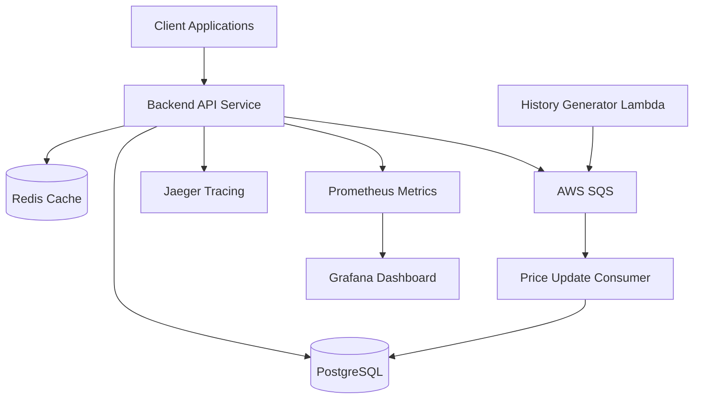
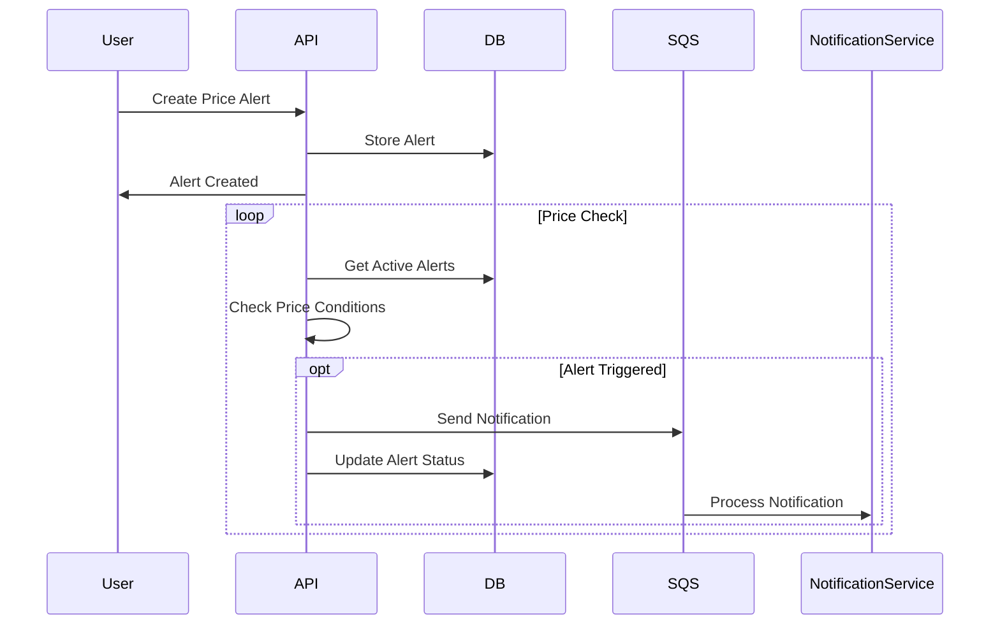
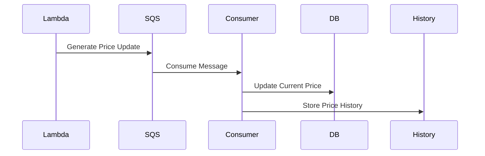

# Crypto Price Alert Service

The Crypto Price Alert Service is a robust, microservices-based system that monitors cryptocurrency prices and sends alerts based on user-defined conditions. Built with TypeScript and AWS services, it provides real-time price monitoring, customizable alerts, and comprehensive price history tracking.

## Architecture

### System Components



### Alert Flow



### Price Update Flow



## Core Features

### 1. Price Monitoring

- Real-time cryptocurrency price tracking
- Historical price data storage
- Price trend analysis
- Volatility calculations

### 2. Alert System

- Multiple alert types:
  - Price threshold (above/below)
  - Price change percentage
  - Volatility alerts
  - Trend change detection
- Customizable time windows
- Alert deduplication
- Active/inactive alert management

### 3. Observability

- Distributed tracing with Jaeger
- Metrics collection with Prometheus
- Visualization with Grafana
- Comprehensive logging

## Technical Stack

### Backend Services

- Node.js & TypeScript
- Fastify web framework
- PostgreSQL database
- Redis caching
- AWS Services (SQS, Lambda)
- Docker & Docker Compose

### Monitoring & Observability

- OpenTelemetry instrumentation
- Jaeger distributed tracing
- Prometheus metrics
- Grafana dashboards

## Project Structure

```
├── apps/
│ ├── backend/ # Main API service
│ │ ├── src/
│ │ │ ├── api/ # API layer
│ │ │ ├── core/ # Domain logic
│ │ │ └── infrastructure/ # External services
│ │ └── Dockerfile
│ └── history-generator/ # Price update Lambda
├── deployments/ # Deployment configurations
│ ├── compose.yml
│ └── prometheus.yml
└── .github/
└── workflows/ # CI/CD pipelines
```

## API Documentation

### Alert Endpoints

- `POST /api/alerts` - Create new alert
- `GET /api/users/:userId/alerts` - Get user alerts
- `PUT /api/alerts/:id` - Update alert
- `DELETE /api/alerts/:id` - Delete alert

### Coin Endpoints

- `GET /api/coins` - List all coins
- `GET /api/coins/:symbol` - Get coin details
- `GET /api/coins/:symbol/history` - Get price history

## Deployment

### Local Development

```bash
# install dependencies
make install

# prepare environment
make prepare

# start services
make compose
```

### Production Deployment

The service uses GitHub Actions for CI/CD:

- Automated testing on pull requests
- Build verification
- AWS Lambda deployment on releases

## Monitoring & Observability

### Tracing

- All services are instrumented with OpenTelemetry
- Trace context propagation across services
- Detailed span attributes for debugging

### Metrics

- Application metrics
- System metrics
- Custom business metrics

### Dashboards

- Real-time price monitoring
- Alert statistics
- System health metrics
- Service performance metrics

## Security Considerations

### API Security

- Rate limiting
- CORS protection
- Helmet security headers
- Input validation

### Infrastructure Security

- AWS IAM roles
- Secure credential management
- Network isolation
- Container security

## Future Enhancements

1. Support for more cryptocurrency exchanges
2. Advanced technical analysis indicators
3. Mobile push notifications
4. WebSocket real-time updates
5. Machine learning price predictions
6. Enhanced alert conditions
7. User authentication and authorization
8. API rate limiting per user

## Contributing

1. Fork the repository
2. Create a feature branch
3. Commit changes
4. Create pull request
5. Ensure CI passes

## License

MIT License - See LICENSE file for details
